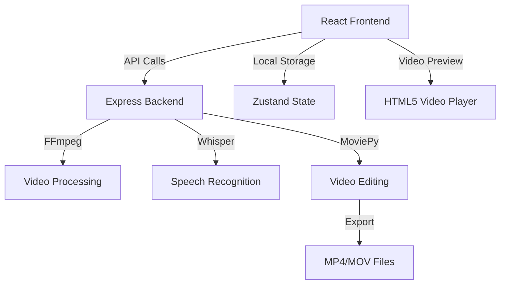
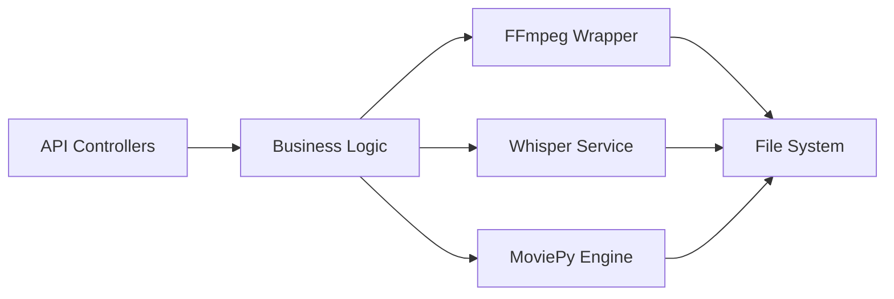

## 1. Architecture Design



## 2. Technology Description
- Frontend: React@18 + TypeScript + tailwindcss@3 + Vite
- Initialization Tool: vite-init
- Backend: Express@4 (Node.js)
- Database: None (本地处理，无需数据库)
- Video Processing: FFmpeg + MoviePy
- Speech Recognition: Whisper (本地或API)
- State Management: Zustand
- UI Components: Custom components + Lucide Icons

## 3. Route Definitions
| Route | Purpose |
|-------|---------|
| / | 视频导入页 - 首页 |
| /editor | 智能剪辑页 |
| /subtitles | 字幕生成页 |
| /materials | 素材匹配页 |
| /export | 导出发布页 |

## 4. API Definitions (if backend exists)

```typescript
// API 响应基础类型
interface ApiResponse<T> {
  success: boolean;
  data?: T;
  error?: string;
}

// 视频上传接口
interface UploadVideoRequest {
  file: File;
}

interface UploadVideoResponse {
  videoId: string;
  filePath: string;
  duration: number;
  fileName: string;
}

// 语音识别接口
interface TranscribeRequest {
  videoId: string;
}

interface TranscribeResponse {
  segments: Array<{
    id: number;
    start: number;
    end: number;
    text: string;
    confidence: number;
  }>;
}

// 剪辑处理接口
interface EditRequest {
  videoId: string;
  cuts: Array<{
    start: number;
    end: number;
  }>;
  removeSilences: boolean;
  silenceThreshold: number;
}

interface EditResponse {
  jobId: string;
  status: 'processing' | 'completed' | 'failed';
}

// 字幕生成接口
interface SubtitleRequest {
  videoId: string;
  style: SubtitleStyle;
}

interface SubtitleStyle {
  fontSize: number;
  fontFamily: string;
  color: string;
  backgroundColor: string;
  position: 'top' | 'center' | 'bottom';
}

interface SubtitleResponse {
  srtUrl: string;
  vttUrl: string;
}

// 导出接口
interface ExportRequest {
  videoId: string;
  format: 'mp4' | 'mov' | 'webm';
  resolution: '720p' | '1080p' | '4k';
  platform: 'tiktok' | 'youtube' | 'bilibili' | 'xiaohongshu';
}

interface ExportResponse {
  downloadUrl: string;
  estimatedTime: number;
}
```

## 5. Server Architecture Diagram (if backend exists)



## 6. Data Model (if applicable)

### 6.1 Data Model Definition
无数据库，使用本地状态管理。

### 6.2 Data Definition Language
不适用（无数据库）
