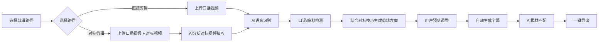

## 1. Product Overview
AI口播视频自动剪辑智能体，帮助创作者快速制作高质量口播短视频，大幅提升内容生产效率。
- 目标用户：短视频创作者、知识博主、企业内容营销人员
- 核心价值：将1-2小时的手工剪辑工作缩短至分钟级
- 特色功能：对标视频分析，自动学习爆款剪辑技巧并应用到你的视频中

## 2. Core Features

### 2.1 User Roles (if applicable)
| Role | Registration Method | Core Permissions |
|------|---------------------|------------------|
| Creator | Local access (无需注册) | 所有功能完整使用 |

### 2.2 Feature Module
1. **视频导入页**: 口播视频上传、对标视频导入、两种剪辑路径选择、文件/URL双格式支持
2. **对标分析页**: 分析对标视频的剪辑技巧、镜头语言、节奏把控
3. **智能剪辑页**: AI自动剪辑、结合对标视频技巧、口误去除、静默片段裁剪
4. **字幕生成页**: 自动字幕生成、编辑、导出
5. **素材匹配页**: AI智能匹配相关视频/图片素材
6. **导出发布页**: 多平台格式导出、封面自动生成

### 2.3 Page Details
| Page Name | Module Name | Feature description |
|-----------|-------------|---------------------|
| 视频导入页 | 直接剪辑入口 | 左侧独立卡片，支持拖拽/点击上传、URL链接导入口播视频 |
| 视频导入页 | 对标剪辑入口 | 右侧独立卡片，分两步上传口播视频和对标视频 |
| 视频导入页 | 文件上传区 | 虚线边框、拖放动画、支持 MP4/MOV/WEBM 格式 |
| 视频导入页 | URL链接区 | 链接输入框、从链接导入按钮、支持视频链接导入 |
| 视频导入页 | 进度显示 | 上传进度条、处理状态提示、准备就绪指示器 |
| 对标分析页 | 视频分析 | AI自动分析对标视频的剪辑点、转场、节奏、字幕风格 |
| 对标分析页 | 技巧总结 | 生成可复用的剪辑技巧报告，包含黄金分割点、节奏曲线、转场方式 |
| 智能剪辑页 | AI分析面板 | 显示语音识别结果、口误标记、静默片段 |
| 智能剪辑页 | 对标技巧应用 | 一键应用对标视频的剪辑风格、节奏模式、转场效果 |
| 智能剪辑页 | 时间轴编辑器 | 可视化剪辑、手动调整、撤销重做 |
| 字幕生成页 | 字幕编辑器 | 实时字幕编辑、样式调整、字体选择 |
| 素材匹配页 | AI推荐素材 | 基于文案智能推荐视频/图片素材库 |
| 导出发布页 | 导出配置 | 分辨率选择、帧率、码率、平台适配 |

## 3. Core Process
用户选择剪辑路径 → 上传口播视频（和可选对标视频）→ AI分析对标视频剪辑技巧（如选择对标路径）→ AI自动分析待剪辑视频 → 识别口误和静默片段 → 结合对标技巧生成剪辑方案 → 用户确认/调整 → 自动添加字幕 → 匹配素材 → 一键导出成品视频

## 4. User Interface Design
### 4.1 Design Style
- Primary color: 深紫 (#6366F1) + 亮橙 (#F97316)
- Secondary colors: 深灰 (#1F2937)、中灰 (#374151)
- Button style: 圆角矩形、渐变色、轻微阴影
- Font: 主标题使用 Orbitron，正文使用 Space Grotesk
- Layout style: 卡片式布局、两列分栏设计
- Icon style: Lucide 线性图标、统一 24x24 尺寸

### 4.2 Page Design Overview
| Page Name | Module Name | UI Elements |
|-----------|-------------|-------------|
| 视频导入页 | 两列布局 | 左右分栏、左侧直接剪辑、右侧对标剪辑 |
| 视频导入页 | 直接剪辑卡片 | 深色背景、视频图标、文件/URL双上传方式 |
| 视频导入页 | 对标剪辑卡片 | 渐变边框、Sparkles图标、两步上传流程 |
| 视频导入页 | 文件上传区 | 虚线边框、拖放动画、进度条实时更新 |
| 视频导入页 | URL输入区 | 链接图标、输入框、导入按钮 |
| 视频导入页 | 视频预览区 | 缩略图、文件名、状态指示器、删除按钮 |
| 对标分析页 | 分析面板 | 双视频对比播放、剪辑点标注、技巧展示卡片 |
| 对标分析页 | 技巧报告 | 可折叠信息面板、数据可视化图表、应用按钮 |
| 智能剪辑页 | 时间轴 | 深色时间轴、波形可视化、彩色标记点 |
| 智能剪辑页 | 对标技巧面板 | 可切换的剪辑风格、一键应用按钮、效果预览 |
| 智能剪辑页 | 控制面板 | 分组卡片、滑块控件、开关按钮 |
| 字幕生成页 | 字幕列表 | 卡片式字幕、可折叠分组、实时预览 |
| 素材匹配页 | 素材网格 | Masonry布局、悬停效果、一键添加 |
| 导出发布页 | 配置面板 | 多平台预设、实时预览、进度反馈 |

### 4.3 Responsiveness
- Desktop-first 设计，完全适配 1920x1080 及以上
- Responsive breakpoints: 1200px, 768px, 480px
- Touch 优化：按钮最小 48x48px，触控区域足够

### 4.4 3D Scene Guidance (if applicable)
不适用
