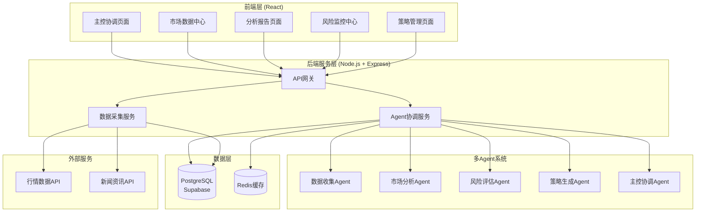
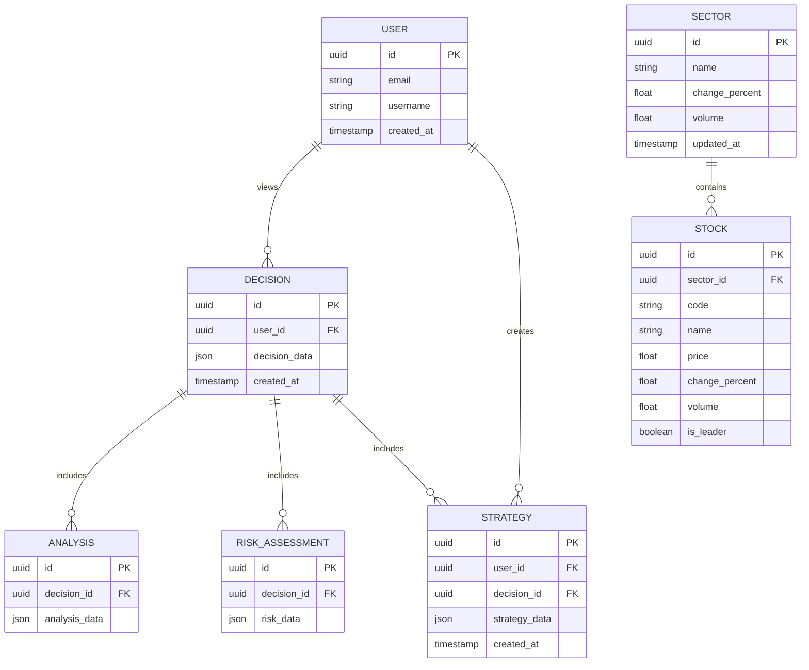

# A股热点轮动交易系统 - 技术架构文档

## 1. 架构设计



## 2. 技术栈说明

- **前端**：React@18 + TypeScript + TailwindCSS@3 + Vite + Recharts
- **初始化工具**：Vite
- **后端**：Node.js@20 + Express@4
- **数据库**：Supabase (PostgreSQL) + Redis
- **图表库**：Recharts, ECharts
- **状态管理**：Zustand
- **UI组件**：shadcn/ui

## 3. 路由定义

| 路由 | 页面组件 | 用途 |
|------|---------|------|
| / | Dashboard | 主控协调页面 - 系统总览 |
| /market | MarketData | 市场数据中心 |
| /analysis | AnalysisReport | 分析报告页面 |
| /risk | RiskMonitor | 风险监控中心 |
| /strategy | StrategyManager | 策略管理页面 |

## 4. API 定义

```typescript
// 请求/响应类型定义
interface MarketDataRequest {
  timestamp: string;
}

interface MarketDataResponse {
  sectors: SectorData[];
  stocks: StockData[];
  fundFlow: FundFlowData;
  news: NewsItem[];
  timestamp: string;
}

interface AnalysisRequest {
  marketData: MarketDataResponse;
}

interface AnalysisResponse {
  hotSpots: HotSpot[];
  sentimentScore: number;
  leaderStocks: LeaderStock[];
  observations: string[];
}

interface RiskRequest {
  marketData: MarketDataResponse;
  analysis: AnalysisResponse;
}

interface RiskResponse {
  riskLevel: 'low' | 'medium' | 'high';
  volatilityScore: number;
  riskFactors: string[];
  alerts: Alert[];
}

interface StrategyRequest {
  analysis: AnalysisResponse;
  risk: RiskResponse;
}

interface StrategyResponse {
  recommendedStrategy: string;
  candidates: Candidate[];
  entryPoints: EntryPoint[];
  stopLoss: StopLoss[];
}

interface TradingDecisionRequest {
  analysis: AnalysisResponse;
  risk: RiskResponse;
  strategy: StrategyResponse;
}

// API 端点
GET /api/market-data    // 获取市场数据
POST /api/analyze       // 触发市场分析
POST /api/assess-risk   // 触发风险评估
POST /api/generate-strategy  // 生成策略
POST /api/make-decision // 综合决策
GET /api/agent-status   // 获取Agent状态
```

## 5. 数据模型

### 5.1 ER 图



### 5.2 数据库定义

```sql
-- 用户表
CREATE TABLE users (
    id UUID PRIMARY KEY DEFAULT gen_random_uuid(),
    email TEXT UNIQUE NOT NULL,
    username TEXT,
    created_at TIMESTAMP WITH TIME ZONE DEFAULT NOW()
);

-- 板块数据表
CREATE TABLE sectors (
    id UUID PRIMARY KEY DEFAULT gen_random_uuid(),
    name TEXT NOT NULL,
    change_percent FLOAT,
    volume BIGINT,
    updated_at TIMESTAMP WITH TIME ZONE DEFAULT NOW()
);

-- 股票数据表
CREATE TABLE stocks (
    id UUID PRIMARY KEY DEFAULT gen_random_uuid(),
    sector_id UUID REFERENCES sectors(id),
    code TEXT NOT NULL,
    name TEXT NOT NULL,
    price FLOAT,
    change_percent FLOAT,
    volume BIGINT,
    is_leader BOOLEAN DEFAULT FALSE,
    updated_at TIMESTAMP WITH TIME ZONE DEFAULT NOW()
);

-- 决策记录表
CREATE TABLE decisions (
    id UUID PRIMARY KEY DEFAULT gen_random_uuid(),
    user_id UUID REFERENCES users(id),
    decision_data JSONB NOT NULL,
    created_at TIMESTAMP WITH TIME ZONE DEFAULT NOW()
);

-- 分析结果表
CREATE TABLE analyses (
    id UUID PRIMARY KEY DEFAULT gen_random_uuid(),
    decision_id UUID REFERENCES decisions(id),
    analysis_data JSONB NOT NULL
);

-- 风险评估表
CREATE TABLE risk_assessments (
    id UUID PRIMARY KEY DEFAULT gen_random_uuid(),
    decision_id UUID REFERENCES decisions(id),
    risk_data JSONB NOT NULL
);

-- 策略表
CREATE TABLE strategies (
    id UUID PRIMARY KEY DEFAULT gen_random_uuid(),
    user_id UUID REFERENCES users(id),
    decision_id UUID REFERENCES decisions(id),
    strategy_data JSONB NOT NULL,
    created_at TIMESTAMP WITH TIME ZONE DEFAULT NOW()
);

-- 启用 RLS
ALTER TABLE users ENABLE ROW LEVEL SECURITY;
ALTER TABLE decisions ENABLE ROW LEVEL SECURITY;
ALTER TABLE strategies ENABLE ROW LEVEL SECURITY;

-- RLS 策略
CREATE POLICY "Users can view their own data" 
    ON users FOR SELECT USING (auth.uid() = id);
CREATE POLICY "Users can view their own decisions" 
    ON decisions FOR SELECT USING (auth.uid() = user_id);
CREATE POLICY "Users can insert their own decisions" 
    ON decisions FOR INSERT WITH CHECK (auth.uid() = user_id);
CREATE POLICY "Users can view their own strategies" 
    ON strategies FOR SELECT USING (auth.uid() = user_id);
CREATE POLICY "Users can insert their own strategies" 
    ON strategies FOR INSERT WITH CHECK (auth.uid() = user_id);

-- 允许匿名用户读取公开数据
CREATE POLICY "Public can view sectors" 
    ON sectors FOR SELECT TO anon USING (true);
CREATE POLICY "Public can view stocks" 
    ON stocks FOR SELECT TO anon USING (true);
```
