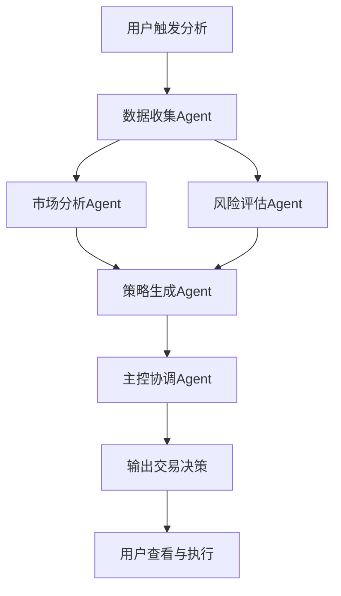

# A股热点轮动交易系统 - 产品需求文档 (PRD)

## 1. 产品概述
A股热点轮动交易系统是一个基于多Agent协同的智能分析平台，通过专业化的AI协作实时追踪、分析和决策A股市场热点板块轮动机会，为用户提供结构化的交易决策支持。
- 解决传统分析方法中信息处理慢、情绪判断难、风险控制弱的问题，面向A股个人投资者和专业交易者
- 提高交易决策的效率和准确性，降低情绪干扰，实现系统化的热点追踪与轮动交易

## 2. 核心功能

### 2.1 核心模块
1. **主控协调页面**：系统总览、实时状态、决策输出
2. **市场数据中心**：行情展示、资金流向、新闻资讯
3. **分析报告页面**：热点识别、情绪分析、龙头追踪
4. **风险监控中心**：风险评估、波动率监控、预警系统
5. **策略管理页面**：策略生成、历史回测、策略对比

### 2.2 页面详情

| 页面名称 | 模块名称 | 功能描述 |
|---------|---------|---------|
| 主控协调页面 | 系统状态面板 | 实时显示各Agent工作状态、数据更新时间、系统健康度 |
| 主控协调页面 | 决策输出模块 | 结构化展示最终交易决策，包括市场主线、热点、评分等 |
| 主控协调页面 | 任务调度器 | 查看和控制Agent工作流程，手动触发分析任务 |
| 市场数据中心 | 行情看板 | 实时展示板块涨跌、成交量、龙头股表现 |
| 市场数据中心 | 资金流向 | 主力资金、北向资金、板块资金流入流出 |
| 市场数据中心 | 新闻资讯 | 聚合市场相关新闻，关键词标注 |
| 分析报告页面 | 热点识别 | 展示当前热点板块、强度评分、扩散分析 |
| 分析报告页面 | 情绪分析 | 市场情绪指数、资金情绪、新闻情绪 |
| 分析报告页面 | 龙头分析 | 龙头股追踪、领涨逻辑、强度演变 |
| 风险监控中心 | 风险仪表盘 | 实时风险等级、波动率、风险因子展示 |
| 风险监控中心 | 预警系统 | 风险阈值设定、异常警报推送 |
| 策略管理页面 | 策略生成器 | 基于分析结果自动生成交易策略 |
| 策略管理页面 | 回测分析 | 历史策略回测、胜率分析、盈亏曲线 |

## 3. 核心流程

### 3.1 多Agent协同分析流程
系统通过五个专业Agent协同工作完成从数据到决策的完整闭环：
1. 数据收集Agent首先采集最新市场数据
2. 市场分析Agent和风险评估Agent并行工作，分别进行热点分析和风险评估
3. 策略生成Agent基于前序结果生成交易策略
4. 主控协调Agent综合所有输出，形成最终交易决策
5. 决策结果通过界面展示给用户



### 3.2 用户使用流程
1. 用户登录系统，查看主控页面实时状态
2. 系统自动定时或用户手动触发分析
3. 用户查看结构化决策报告
4. 根据策略进行交易或调整参数
5. 记录交易结果，用于系统优化

## 4. 用户界面设计

### 4.1 设计风格
- **主色调**：深蓝色（#1a365d）代表专业稳重，辅以橙色（#ed8936）作为强调色
- **次要色**：绿色（#48bb78）表示上涨，红色（#f56565）表示下跌
- **按钮风格**：圆角矩形，轻微阴影，hover时有微动画
- **字体**：Inter 字体体系，H1: 32px, H2: 24px, Body: 16px
- **布局风格**：卡片式布局，侧边栏导航，深色主题
- **图标风格**：线性图标，统一24px网格，使用Feather Icons风格

### 4.2 页面设计概览

| 页面名称 | 模块名称 | UI元素 |
|---------|---------|--------|
| 主控协调页面 | 系统状态面板 | 网格布局、状态指示器、进度条、深色卡片背景 |
| 主控协调页面 | 决策输出模块 | JSON预览区域、关键指标卡片、可折叠详情 |
| 市场数据中心 | 行情看板 | 热力图、涨跌排序、实时更新动画、图表展示 |
| 分析报告页面 | 热点识别 | 板块卡片、强度进度条、扩散关系可视化 |
| 风险监控中心 | 风险仪表盘 | 仪表盘组件、趋势线、颜色渐变风险指示器 |
| 策略管理页面 | 策略生成器 | 表单组件、滑块控件、预览区域 |

### 4.3 响应式设计
- **Desktop-first**：优先优化1920×1080桌面体验
- **平板适配**：1024×768断点，侧边栏可折叠
- **移动端**：480px断点，垂直堆叠布局，触控优化
- **触摸优化**：按钮最小44×44px，手势支持

## 5. 多Agent系统设计

### 5.1 Agent角色定义

| Agent名称 | 核心职责 | 输入源 | 输出格式 |
|---------|---------|-------|---------|
| 数据收集Agent | 数据采集、清洗、标准化 | 行情API、新闻源 | 结构化数据快照 |
| 市场分析Agent | 热点识别、情绪分析、龙头追踪 | 市场数据 | 分析报告JSON |
| 风险评估Agent | 风险评级、波动率计算、预警 | 数据+分析 | 风险评估JSON |
| 策略生成Agent | 策略制定、标的筛选、买卖点建议 | 分析+风险 | 策略方案JSON |
| 主控协调Agent | 工作流编排、结果综合、决策输出 | 全部Agent输出 | 最终决策JSON |

### 5.2 数据交互格式

```typescript
// 最终决策输出格式
interface TradingDecision {
  market_main_line: string;
  core_hot_spots: string[];
  hot_sustainability_score: number; // 0-100
  market_sentiment_score: number; // 0-100
  risk_level: 'low' | 'medium' | 'high';
  recommended_strategy: string;
  candidate_directions: string[];
  areas_to_avoid: string[];
  timestamp: string;
}

// Agent工作状态
interface AgentStatus {
  agentName: string;
  status: 'idle' | 'working' | 'completed' | 'error';
  lastUpdate: string;
  progress?: number;
}
```
