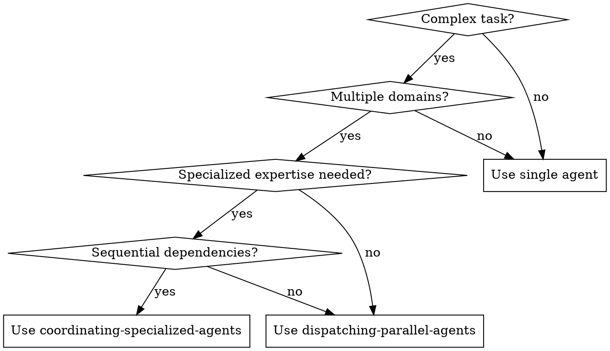

# Coordinating Specialized Agents

## Overview

This skill teaches you how to orchestrate multiple specialized agents to work together on complex tasks that require different areas of expertise, like financial market analysis, multi-domain system design, or comprehensive research projects.

**Core principle:** Each specialized agent focuses on one domain, while a coordinator agent synthesizes their work into a coherent whole.

## When to Use



**Use when:**
- Task requires multiple distinct areas of expertise (e.g., market analysis + risk assessment + strategy formulation)
- Agents' work depends on each other's outputs
- Need a coordinator to synthesize diverse inputs into decisions
- Complex decision-making requiring multiple perspectives
- Systems like financial trading, research synthesis, or multi-component design

**Don't use when:**
- Simple, single-domain tasks
- Agents can work completely independently (use dispatching-parallel-agents instead)
- No need for synthesis or coordination of results

## Agent Roles Architecture

### Coordinator Agent
The orchestrator who:
- Defines the overall workflow
- Assigns tasks to specialized agents
- Collects and synthesizes outputs
- Makes final decisions
- Manages dependencies between agents

### Specialized Agents
Each focused on one domain with clear responsibilities:
- Data Collection Agent - gathers raw data
- Analysis Agent - processes and interprets data
- Risk Assessment Agent - evaluates risks
- Strategy Agent - formulates recommendations
- Verification Agent - validates results

## Core Coordination Patterns

### Pattern 1: Sequential Pipeline
Agents work in a chain, each building on the previous.

```
Data Agent → Analysis Agent → Risk Agent → Strategy Agent → Coordinator
```

**Best for:** Tasks where each step depends on the previous output

### Pattern 2: Parallel with Synthesis
Multiple agents work independently, then coordinator synthesizes.

```
Data Agent ─┐
Analysis Agent ──→ Coordinator
Risk Agent ─────┘
Strategy Agent ──┘
```

**Best for:** Tasks requiring multiple perspectives on the same problem

### Pattern 3: Iterative Refinement
Agents work in a feedback loop with coordinator.

```
Coordinator → Agent 1 → Coordinator → Agent 2 → Coordinator (decision)
```

**Best for:** Complex decisions requiring multiple rounds of refinement

## Quick Reference

| Step | Action | Output |
|------|--------|--------|
| 1 | Define roles & responsibilities | Agent role descriptions |
| 2 | Design workflow & dependencies | Workflow diagram |
| 3 | Dispatch specialized agents | Individual agent reports |
| 4 | Synthesize outputs | Coordinated analysis |
| 5 | Make final decision | Actionable recommendations |

## Implementation

### Step 1: Define Agent Roles

First, clearly define each agent's purpose and output format.

```markdown
## Market Analysis Agent
**Purpose:** Analyze current market trends and identify hot sectors
**Input:** Latest market data
**Output Format:**
{
  "hot_sectors": ["sector1", "sector2"],
  "market_sentiment": "bullish/bearish/neutral",
  "key_observations": [...]
}

## Risk Assessment Agent  
**Purpose:** Evaluate potential risks and market volatility
**Input:** Market data + analysis agent output
**Output Format:**
{
  "risk_level": "low/medium/high",
  "volatility_score": 0-100,
  "risk_factors": [...]
}

## Strategy Agent
**Purpose:** Formulate trading strategies based on analysis and risk
**Input:** Analysis + risk outputs
**Output Format:**
{
  "recommended_positions": [...],
  "entry_points": [...],
  "stop_loss": [...]
}
```

### Step 2: Design Workflow

Define the sequence and dependencies between agents.

```
Coordinator:
1. Dispatch Data Agent
2. Wait for data
3. Dispatch Analysis Agent (with data)
4. Dispatch Risk Agent (with data + analysis)  
5. Wait for both
6. Dispatch Strategy Agent (with all previous)
7. Synthesize all outputs
8. Make final decision
```

### Step 3: Dispatch Agents with Context

Each specialized agent gets precise instructions and the exact context they need.

**Example - Dispatching Market Analysis Agent:**

```markdown
You are the Market Analysis Agent for our A-share hot sector rotation trading system.

## Your Task
Analyze the provided market data and identify current hot sectors, market sentiment, and key observations.

## Input Data
[Paste market data here]

## Requirements
1. Focus on sector performance over the past 5 trading days
2. Identify top 3 hot sectors with supporting evidence
3. Assess overall market sentiment (bullish/bearish/neutral)
4. List 3-5 key market observations

## Output Format
Return your analysis in EXACTLY this JSON format:
{
  "hot_sectors": [
    {"name": "sector1", "strength": 0-100, "reasoning": "..."},
    {"name": "sector2", "strength": 0-100, "reasoning": "..."},
    {"name": "sector3", "strength": 0-100, "reasoning": "..."}
  ],
  "market_sentiment": "bullish",
  "key_observations": ["observation1", "observation2", "observation3"]
}

DO NOT include any additional text outside the JSON.
```

### Step 4: Synthesize Outputs

As coordinator, collect all agent outputs and synthesize them into a coherent decision.

**Synthesis Template:**

```markdown
## Agent Output Collection
[Paste each agent's output here]

## Synthesis & Decision

### Market Main Line
[Identify the core market theme from analysis agent]

### Hot Sectors
[Summarize hot sectors with strength scores]

### Risk Assessment
[Highlight key risks from risk agent]

### Market Sentiment Score: 0-100
[Calculate sentiment score]

### Hot Sector Sustainability Score: 0-100
[Calculate sustainability score]

### Risk Level
[low/medium/high]

### Recommended Strategy
[Synthesize strategy agent's recommendations with risk considerations]

### Candidate Directions
[List potential investment directions]

### Areas to Avoid
[List high-risk areas]
```

### Step 5: Structured Final Output

Always produce a structured output for decision-making.

```json
{
  "market_main_line": "Current market core theme",
  "core_hot_spots": ["sector1", "sector2"],
  "hot_sustainability_score": 75,
  "market_sentiment_score": 68,
  "risk_level": "medium",
  "recommended_strategy": "Specific actionable strategy",
  "candidate_directions": ["direction1", "direction2"],
  "areas_to_avoid": ["area1", "area2"]
}
```

## Common Mistakes

### ❌ Overloading One Agent
```markdown
Bad: "Analyze the market, assess risk, and create a strategy"
Good: Split into three specialized agents with clear responsibilities
```

### ❌ Vague Instructions
```markdown
Bad: "Do some market analysis"
Good: "Analyze sector performance over 5 days, identify top 3 hot sectors with evidence, assess sentiment"
```

### ❌ Unstructured Outputs
```markdown
Bad: "I think tech is hot and maybe we should be careful"
Good: Structured JSON with explicit fields and scores
```

### ❌ Forgetting Dependencies
```markdown
Bad: Dispatch strategy agent before analysis is complete
Good: Explicitly define workflow dependencies and sequence
```

## Real-World Example: A-Share Trading System

### Coordinator's Workflow

```markdown
## A-Share Hot Sector Rotation - Coordination Workflow

### Phase 1: Data Collection
- Dispatch Data Agent → Collect latest market data

### Phase 2: Parallel Analysis
- Dispatch Market Analysis Agent (with data)
- Dispatch Risk Assessment Agent (with data)

### Phase 3: Strategy Formulation
- Wait for Phase 2 agents
- Dispatch Strategy Agent (with Phase 2 outputs)

### Phase 4: Synthesis & Decision
- Collect all agent outputs
- Synthesize into final trading plan
- Output structured decision

## Agent Roles

### Data Agent
Collects: sector performance, volume data, price movements
Output: Structured market data snapshot

### Analysis Agent
Analyzes: sector momentum, leadership stocks, breadth
Output: Hot sectors, sentiment, observations

### Risk Agent
Evaluates: volatility, downside risk, market breadth
Output: Risk level, volatility score, risk factors

### Strategy Agent
Formulates: position recommendations, entry points, stops
Output: Actionable trading strategy
```

### Dispatching the Risk Agent

```markdown
You are the Risk Assessment Agent.

## Your Task
Evaluate the current market risk profile based on the provided data and analysis.

## Inputs
Market Data: [paste data]
Market Analysis: [paste analysis agent output]

## Output Format
{
  "risk_level": "medium",
  "volatility_score": 65,
  "risk_factors": [
    "High rotation speed between sectors",
    "Weakening market breadth",
    "Elevated single-stock volatility"
  ],
  "downside_protection_needed": true,
  "position_sizing_guidance": "Conservative - max 50%仓位"
}

## Key Factors to Consider
- Sector rotation speed
- Market breadth (advancers vs decliners)
- Volume trends
- Leading stocks' performance
```

### Coordinator's Final Synthesis

```markdown
## Synthesis of Agent Outputs

### Analysis Agent Says:
- Hot sectors: AI (85), New Energy (72), Consumer Electronics (68)
- Sentiment: Bullish leaning
- Key observation: Strong institutional buying in AI

### Risk Agent Says:
- Risk level: Medium
- Volatility score: 65
- Risk: Fast sector rotation, watch for pullbacks

### Strategy Agent Says:
- Focus on AI leaders
- Entry on pullbacks
- Stop loss at -5%

## Final Trading Plan
{
  "market_main_line": "AI sector driven by institutional buying",
  "core_hot_spots": ["AI", "New Energy"],
  "hot_sustainability_score": 75,
  "market_sentiment_score": 68,
  "risk_level": "medium",
  "recommended_strategy": "Focus on AI leaders on pullbacks with strict stop loss",
  "candidate_directions": ["AI leaders", "New Energy upstream"],
  "areas_to_avoid": ["High valuation small caps", "Previous hot sectors losing momentum"]
}
```

## Best Practices

1. **Clear Role Boundaries:** Each agent should have one primary responsibility
2. **Structured Input/Output:** Always define exact JSON formats for agent outputs
3. **Explicit Dependencies:** Document what each agent needs from previous agents
4. **Single Coordinator:** One agent responsible for synthesis and decisions
5. **Validation Step:** Consider adding a verification agent to cross-check results
6. **Iteration Loops:** For complex decisions, build in feedback cycles

## Red Flags - STOP and Reassess

- Agents are waiting on each other with no clear workflow
- Outputs are unstructured and hard to synthesize
- One agent is doing work that should be split
- No clear decision-making framework
- Instructions are vague and open to interpretation

**If you see these:** Pause, redesign the workflow, and clarify roles before proceeding.
